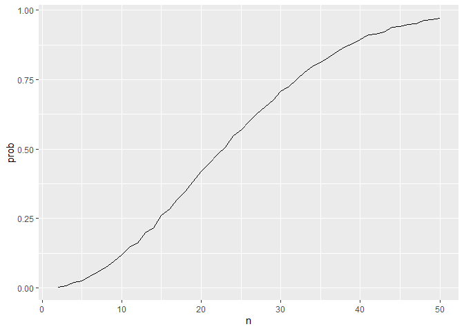

p8105_hw5_jt3466
================
Johnstone Tcheou
2024-11-05

# Question 1

``` r
bday_sim <- function(n) {
  
  bdays <- sample(1:365, size = n, replace = TRUE)
  
  duplicate = length(unique(bdays)) < n
  
  return(duplicate)
  
}

bday_2_50 <- 
  expand_grid(
    n = 2:50,
    iter = 1:10000
  ) |> 
  mutate(
    res = map_lgl(n, bday_sim) 
  ) |> 
  group_by(n) |> 
  summarize(prob = mean(res))

bday_2_50 |> 
  ggplot(aes(x = n, y = prob)) + 
  geom_line()
```

<!-- --> Based on the
graph, we see that the probability of having at least 2 people with the
same birthday is approximately logarithmic. Around a group size of 23,
the probability of having 2 or more with the same birthday is around
50%, which gradually increases until plateauing near 100% with around 50
people in the group. The slope of probability per group size appears to
be the highest from a group size of 10 to 30.

# Question 2

``` r
pop_size <- 30
pop_sd <- 5
alpha <- 0.05

sim_data <- 
  expand_grid(
    i = 1:5000,
    pop_mean = c(0:6)
  ) |>
  mutate(
    data = map(pop_mean, \(x) rnorm(n = pop_size, mean = x, sd = pop_sd)),
    ttest = map(data, \(x) t.test(x = x, mu = 0, alternative = "two.sided")),
    results = map(ttest, broom::tidy)
  ) |> 
  unnest(cols = results) 
```

``` r
sim_res_data <- 
  sim_data |> 
  select(pop_mean, estimate, p.value) |> 
  rename(estimated_mean = estimate) |> 
  arrange(pop_mean) |> 
  group_by(pop_mean) |> 
  mutate(
    significant = case_when(
      p.value < 0.05 ~ 1,
      p.value > 0.05 ~ 0,
      .default = NA
    ), 
    prptn_sig = mean(significant)
  ) 

sim_res_data |> 
  ggplot(aes(x = pop_mean, y = prptn_sig)) + 
  geom_line() +
  labs(
      x = "True population mean (mu)",
      y = "Proportion of significantly different estimated means \n(power of test)"
    ) 
```

<!-- -->

Based on the graph, we see that as population mean increases, the
proportion of tests that are significant increases. It the greatest
increase in proportion significant is between 1 to 3, where it starts to
taper off and plateau close to 100% by a population mean of 4.

As such, this indicates that as population mean increases, it is getting
further from the mu we are testing of 0, so effect size is increasing,
and the power to detect a significant difference increases as the effect
size increases.

``` r
avg_mu_hats <-
  sim_res_data |> 
  group_by(pop_mean) |> 
  mutate(
    avg_estimated_mean = mean(estimated_mean) 
  )

sig_avg_mu_hats <- 
  sim_res_data |> 
  filter(significant == 1) |> 
  group_by(pop_mean) |> 
  mutate(
    avg_estimated_mean = mean(estimated_mean) 
  )

avg_mu_hats |> 
  ggplot(aes(x = pop_mean, y = estimated_mean)) +
  geom_point() + 
  geom_line(aes(x = pop_mean, y = avg_estimated_mean)) + 
  geom_point(data = sig_avg_mu_hats, 
             aes(x = pop_mean, y = estimated_mean, color = "red"),
             alpha = 0.25) + 
  geom_line(data = sig_avg_mu_hats, 
            aes(x = pop_mean, y = avg_estimated_mean, color = "red"), 
            linetype = "dashed") + 
  scale_y_continuous(
    breaks = seq(-3, 10, by = 1)
  ) +
  scale_x_continuous(
    breaks = seq(0, 6, by = 1)
  ) +
  labs(
      x = "True population mean (mu)",
      y = "Average of estimated means (average of mu hat)"
    ) +
  guides(
    color = "none"
  )
```

<!-- -->

The plot shows that as the true population mean increases, the average
estimated mean also increases. The black points are all the estimated
means for a given population mean, while the red points are the
estimated means with a significant difference from the population mean.
This is in line with the last graph, where a larger proportion of points
are significant as the true population mean is higher (indicating larger
effect size with increasing true population mean)

As expected, the average estimated mean for all estimates of the same
population mean is approximately the population mean. However, for the
sample average estimated means for estimates significantly different
from the null, the trend is largely similar except when the population
mean is 1 and to a lesser extent, 2. When the population mean is 1, the
average estimated mean among significant estimates is 2.2523549 instead
of 1. When the population mean is 2, the average estimated mean among
significant estimates is 2.6106834.

This somewhat makes sense given that when mu = 1, the lowest of the
significantly different estimated means is still above mu itself (the
black line), whereas that effect of the red points being above the black
line decreases as mu increases. And for mu = 0, there is an
approximately even distribution of significant points above and below
mu, which is why the average estimated means is around mu = 0, as the
two sides balance out.

``` r
sig_avg_mu_hats |> 
  mutate(
    pop_mean = factor(pop_mean)
  ) |> 
  ggplot(aes(x = pop_mean, y = estimated_mean, fill = pop_mean)) +
  geom_violin() +
  stat_summary(fun = "mean") + 
  scale_y_continuous(
    breaks = seq(-3, 10, by = 1)
  ) +
  guides(
    fill = "none"
  )
```

    ## Warning: Removed 7 rows containing missing values or values outside the scale range
    ## (`geom_segment()`).

<!-- -->

This is reinforced when looking at the distribution of estimated means
grouped by the population mean the sample came from. When mu is 1, the
distribution appears to have a left tail with only a smattering of
points in the negative, while the bulk of points are around 2 but bound
by the standard deviation around mu to keep the maximum estimated mean
around 4.

# Question 3

``` r
wp_data <- 
  read_csv(
    file = "https://raw.githubusercontent.com/washingtonpost/data-homicides/refs/heads/master/homicide-data.csv"
  ) 
```

    ## Rows: 52179 Columns: 12
    ## ── Column specification ────────────────────────────────────────────────────────
    ## Delimiter: ","
    ## chr (9): uid, victim_last, victim_first, victim_race, victim_age, victim_sex...
    ## dbl (3): reported_date, lat, lon
    ## 
    ## ℹ Use `spec()` to retrieve the full column specification for this data.
    ## ℹ Specify the column types or set `show_col_types = FALSE` to quiet this message.

``` r
summary(wp_data)
```

    ##      uid            reported_date       victim_last        victim_first      
    ##  Length:52179       Min.   : 20070101   Length:52179       Length:52179      
    ##  Class :character   1st Qu.: 20100318   Class :character   Class :character  
    ##  Mode  :character   Median : 20121216   Mode  :character   Mode  :character  
    ##                     Mean   : 20130899                                        
    ##                     3rd Qu.: 20150911                                        
    ##                     Max.   :201511105                                        
    ##                                                                              
    ##  victim_race         victim_age         victim_sex            city          
    ##  Length:52179       Length:52179       Length:52179       Length:52179      
    ##  Class :character   Class :character   Class :character   Class :character  
    ##  Mode  :character   Mode  :character   Mode  :character   Mode  :character  
    ##                                                                             
    ##                                                                             
    ##                                                                             
    ##                                                                             
    ##     state                lat             lon          disposition       
    ##  Length:52179       Min.   :25.73   Min.   :-122.51   Length:52179      
    ##  Class :character   1st Qu.:33.77   1st Qu.: -96.00   Class :character  
    ##  Mode  :character   Median :38.52   Median : -87.71   Mode  :character  
    ##                     Mean   :37.03   Mean   : -91.47                     
    ##                     3rd Qu.:40.03   3rd Qu.: -81.76                     
    ##                     Max.   :45.05   Max.   : -71.01                     
    ##                     NA's   :60      NA's   :60

The raw dataset is 52179 observations long and 12 variables wide for 50
different cities. The key variables include `victim_first` and
`victim_last` to provide the victim’s name, as well as victim
demographic info like `victim_age`, `victim_sex`, and `victim_race`, as
well as the `city` and `state` (with longitudinal data) and the
`reported_date` of the homicide. The `reported_date` variable was
imported as a numeric type, not as a library type, and there is an
observation with a date of 2.015111^{8}, which is not sensical.

``` r
wp_data <- 
  read_csv(
    file = "https://raw.githubusercontent.com/washingtonpost/data-homicides/refs/heads/master/homicide-data.csv"
  ) |> 
  mutate(
    reported_date = case_match(
      reported_date,
      201511105 ~ 20151105,
      201511018 ~ 20151018,
      .default = reported_date
    ),
    reported_date = ymd(reported_date),
    city_state = paste(city, state, sep = ", ")
  )
```

    ## Rows: 52179 Columns: 12
    ## ── Column specification ────────────────────────────────────────────────────────
    ## Delimiter: ","
    ## chr (9): uid, victim_last, victim_first, victim_race, victim_age, victim_sex...
    ## dbl (3): reported_date, lat, lon
    ## 
    ## ℹ Use `spec()` to retrieve the full column specification for this data.
    ## ℹ Specify the column types or set `show_col_types = FALSE` to quiet this message.

After changing that observation, there is another date with `201511018`,
so it appears these all have an extra 1 before the month. These two
observations are changed accordingly. Now that all `reported_date`s are
in the format `yyyymmdd`, the `ymd` function from the `lubridate`
package is used to convert these to dates. A variable `city_state` is
created from concatenating the `city` and `state` variables. The
variable names are already tidy, so `clean_names` from the `janitor`
package is not needed.

``` r
wp_prop <-
  wp_data |> 
  group_by(city_state) |> 
  summarize(total_homicides = n(),
            open_homicides = sum(disposition %in% c("Closed without arrest", "Open/No arrest"))) |> 
  mutate(
    prop_unsolved = open_homicides/total_homicides
  ) 

wp_prop |> 
  arrange(desc(total_homicides)) |> 
  knitr::kable(digits = 3)
```

| city_state         | total_homicides | open_homicides | prop_unsolved |
|:-------------------|----------------:|---------------:|--------------:|
| Chicago, IL        |            5535 |           4073 |         0.736 |
| Philadelphia, PA   |            3037 |           1360 |         0.448 |
| Houston, TX        |            2942 |           1493 |         0.507 |
| Baltimore, MD      |            2827 |           1825 |         0.646 |
| Detroit, MI        |            2519 |           1482 |         0.588 |
| Los Angeles, CA    |            2257 |           1106 |         0.490 |
| St. Louis, MO      |            1677 |            905 |         0.540 |
| Dallas, TX         |            1567 |            754 |         0.481 |
| Memphis, TN        |            1514 |            483 |         0.319 |
| New Orleans, LA    |            1434 |            930 |         0.649 |
| Las Vegas, NV      |            1381 |            572 |         0.414 |
| Washington, DC     |            1345 |            589 |         0.438 |
| Indianapolis, IN   |            1322 |            594 |         0.449 |
| Kansas City, MO    |            1190 |            486 |         0.408 |
| Jacksonville, FL   |            1168 |            597 |         0.511 |
| Milwaukee, wI      |            1115 |            403 |         0.361 |
| Columbus, OH       |            1084 |            575 |         0.530 |
| Atlanta, GA        |             973 |            373 |         0.383 |
| Oakland, CA        |             947 |            508 |         0.536 |
| Phoenix, AZ        |             914 |            504 |         0.551 |
| San Antonio, TX    |             833 |            357 |         0.429 |
| Birmingham, AL     |             800 |            347 |         0.434 |
| Nashville, TN      |             767 |            278 |         0.362 |
| Miami, FL          |             744 |            450 |         0.605 |
| Cincinnati, OH     |             694 |            309 |         0.445 |
| Charlotte, NC      |             687 |            206 |         0.300 |
| Oklahoma City, OK  |             672 |            326 |         0.485 |
| San Francisco, CA  |             663 |            336 |         0.507 |
| Pittsburgh, PA     |             631 |            337 |         0.534 |
| New York, NY       |             627 |            243 |         0.388 |
| Boston, MA         |             614 |            310 |         0.505 |
| Tulsa, OK          |             583 |            193 |         0.331 |
| Louisville, KY     |             576 |            261 |         0.453 |
| Fort Worth, TX     |             549 |            255 |         0.464 |
| Buffalo, NY        |             521 |            319 |         0.612 |
| Fresno, CA         |             487 |            169 |         0.347 |
| San Diego, CA      |             461 |            175 |         0.380 |
| Stockton, CA       |             444 |            266 |         0.599 |
| Richmond, VA       |             429 |            113 |         0.263 |
| Baton Rouge, LA    |             424 |            196 |         0.462 |
| Omaha, NE          |             409 |            169 |         0.413 |
| Albuquerque, NM    |             378 |            146 |         0.386 |
| Long Beach, CA     |             378 |            156 |         0.413 |
| Sacramento, CA     |             376 |            139 |         0.370 |
| Minneapolis, MN    |             366 |            187 |         0.511 |
| Denver, CO         |             312 |            169 |         0.542 |
| Durham, NC         |             276 |            101 |         0.366 |
| San Bernardino, CA |             275 |            170 |         0.618 |
| Savannah, GA       |             246 |            115 |         0.467 |
| Tampa, FL          |             208 |             95 |         0.457 |
| Tulsa, AL          |               1 |              0 |         0.000 |

I was a little surprised at how low the homicide count was for NYC, with
how population dense a city it is. It also had a relatively low
proportion unsolved compared to other cities. Chicago had a large number
of total homicides, and a large proportion of it unsolved. I wonder if
that is because of the sheer number of homicides, but Philadelphia with
the next closest total homicides had a comparatively much lower
proportion of unsolved homicides.

``` r
baltimore_prop <- 
  wp_prop |> 
  filter(city_state == "Baltimore, MD") |> 
  mutate(
    prop_test = map(open_homicides, prop.test, n = total_homicides),
    prop_test_tidy = map(prop_test, broom::tidy)
  ) |> 
  select(prop_test_tidy) |> 
  unnest(prop_test_tidy) |> 
  select(estimate, starts_with("conf"))

baltimore_prop |> 
  knitr::kable(digits = 3)
```

| estimate | conf.low | conf.high |
|---------:|---------:|----------:|
|    0.646 |    0.628 |     0.663 |

``` r
wp_prop |> 
  mutate(
    prop_test = map2(open_homicides, total_homicides, prop.test),
    prop_test_tidy = map(prop_test, broom::tidy)
  ) |> 
  unnest(prop_test_tidy) |> 
  select(city_state, estimate, starts_with("conf")) |> 
  arrange(desc(estimate)) |> 
  mutate(
    city_state = fct_reorder(city_state, estimate)
  ) |> 
  ggplot(aes(x = city_state, y = estimate, fill = city_state)) +
    geom_col() + 
    geom_errorbar(aes(ymin = conf.low, ymax = conf.high)) + 
    viridis::scale_fill_viridis(discrete = TRUE) +
    labs(
      x = "City, state",
      y = "Estimated proportion of unsolved homicides"
    ) +
    theme(
      axis.text.x = element_text(angle = 90, vjust = 0.5) 
    ) +
    guides(
      fill = "none"
    )
```

    ## Warning: There was 1 warning in `mutate()`.
    ## ℹ In argument: `prop_test = map2(open_homicides, total_homicides, prop.test)`.
    ## Caused by warning in `.f()`:
    ## ! Chi-squared approximation may be incorrect

<!-- -->

As alluded to earlier, Chicago not only has the most total homicides but
also the highest proportion of unsolved homicides by a solid margin. The
next highest two are Baltimore and New Orleans, which both rank
relatively high for total homicides. CIs are pretty narrow for the most
part, especially for Chicago. However, there is a super wide CI for
Tulsa, AL, which makes sense given that there was 1 total homicide and
it was a closed case, leading to low confidence for the estimated
proportion and a wide CI.
